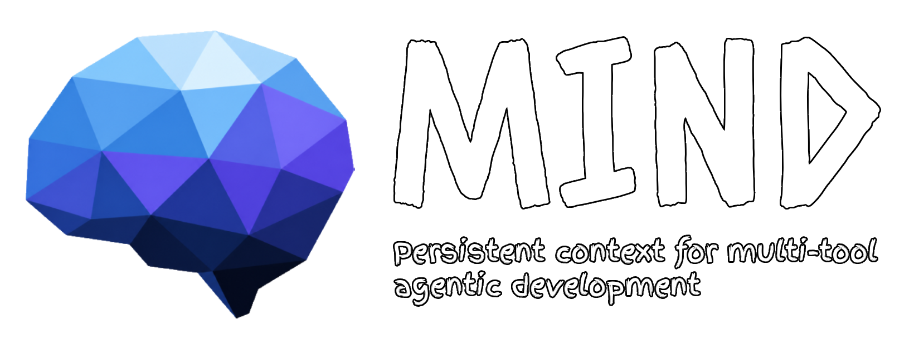

<p align="center">
  
</p>

<p align="center">
  
  
  
  
</p>

## What is mind?

`mind` is a single file memory layer for AI-assisted development. It reads your conversations from Claude Code, Gemini, Cursor, Codex, and Copilot after every commit and synthesizes them into one token efficient `mind.md` that every tool can load as context.

I built this because I kept hitting the same wall across projects — every AI tool has its own rules, its own memory, its own prompt format, and none of them talk to each other. You can configure behaviors per tool (rules and skills etc), but there's no shared, consistent context that travels with the project. So I'd find myself re-explaining the same architecture decisions, the same gotchas, the same "we tried that and it didn't work" notes to a different model every other day.

`mind` is the simplest fix I could think of: **one file**, written and updated by LLM after each commit, aggregating context from every tool you use into one place.

## Install

```bash
pip install project-mind
```

## Quick start

```bash
cd your-project
mind init      # creates _mind/, installs git hook, writes mind.toml
mind sync      # extract transcripts and rebuild mind.md
mind status    # show tracked tools and last sync
```

The git hook runs `mind sync` automatically after every commit.

## Supported tools

| Tool | Source |
|---|---|
| Claude Code | `~/.claude/projects/{slug}/*.jsonl` |
| Gemini | `~/.gemini/tmp/{project}/chats/*.json` |
| Cursor | `~/.cursor/projects/{slug}/agent-transcripts/` |
| Codex | `~/.codex/sessions/**/rollout-*.jsonl` |
| Copilot | VS Code `workspaceStorage/{hash}/state.vscdb` |

## How it works

1. After every `git commit`, the hook runs `mind sync` in the background.
2. `mind sync` finds transcripts newer than the last sync and extracts the user + assistant text.
3. It calls your configured LLM with the extracted content and the current `mind.md`.
4. The LLM rewrites `mind.md` — compressing old entries, adding new ones, preserving the sections you care about.

## `mind.md` structure

```
## behavior     user corrections — never compressed
## context      project state — rewritten each sync
## active       in-flight tasks
## decisions    architectural choices
## lessons      what worked, what didn't
## history      compressed timeline
```

## Configuration

```toml
# mind.toml
[project]
name = "my-project"

[llm]
provider = "claude"   # claude | gemini | codex

[tools]
enabled = ["claude", "gemini", "cursor", "codex", "copilot"]

[limits]
max_messages_per_sync = 150
mind_max_lines = 150
```

## License

MIT
